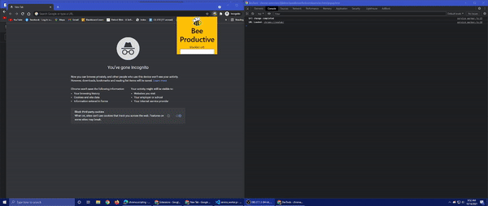

# Bee Productive

Bee Productive is a chrome extension that has a number of features to keep the user productive while studying.

## Features

- Blacklist unproductive sites for a set period of time
- Customizable Pomodoro timer
- Simple visual aid

## Installation

1. Open the Extention Management page by navigating to ```chrome://extensions```
    - Alternatively, open this page by clicking on the Extensions menu button and selecting Manage Extensions at the bottom of the menu.
    - Alternatively, open this page by clicking on the Extensions menu button and selecting Manage Extensions at the bottom of the menu.
1. Enable Developer Mode by clicking the toggle switch next to ```Developer mode```.
1. Click the ```Load unpacked``` button.

## How to use the extension
- Right click on the extension on the top right corner next to the addressbar and click on Inspect Popup. **NOTE:** This needs to open for the extension to workproperly. 
- For the timer to work properly, you need to enter the time in minutes and click the corresponding ```Set Time``` button.
- Click the ```Start Timer``` button to start the timer.
- During this time, while the extension window is still visible, if you visit a blacklisted site, you will get an alert.
### Feature Preview



[Extended version of the gif above](https://youtu.be/vqzp93tElJ4)

**Note:** The above gif is a preview of the feature. The feature is not yet complete.

**Note:** To see the results of the feature working proprely, you must right click on the extention and select "Inspect Popup". For best experience, reload the page or continue using the same tab.
